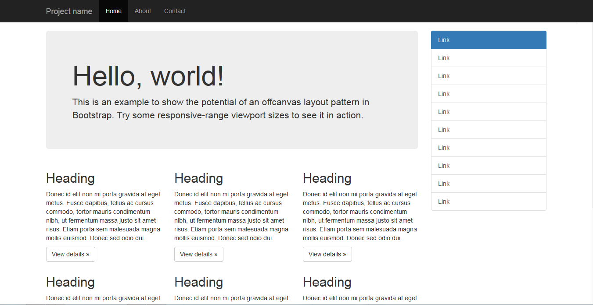

# Bootstrap (front-end framework)

Bootstrap (formerly Twitter Bootstrap) is a free and open-source CSS framework directed at responsive, mobile-first front-end web development. It contains HTML, CSS and (optionally) JavaScript-based design templates for typography, forms, buttons, navigation, and other interface components.

As of May 2023, Bootstrap is the 17th most starred project (4th most starred library) on GitHub, with over 164,000 stars. According to W3Techs, Bootstrap is used by 19.2% of all websites.

The most prominent components of Bootstrap are its layout components, as they affect an entire web page. The basic layout component is called "Container", as every other element in the page is placed in it. Developers can choose between a fixed-width container and a fluid-width container. While the latter always fills the width with the web page, the former uses one of the five predefined fixed widths, depending on the size of the screen showing the page:

- Smaller than 576 pixels
- 576–768 pixels
- 768–992 pixels
- 992–1200 pixels
- Larger than 1200 pixels

[Learn more about breakpoints in Bootstrap](https://getbootstrap.com/docs/5.3/layout/breakpoints/)

> Bootstrap has revolutionized the way I approach web development. Its intuitive grid system and extensive component library have truly elevated my design process.

Megan Adams, member of Web.dev Circle

## Contributors

| Name   | Area of contribution | Handle on GitHub |
| ------ | -------------------- | ---------------- |
| Chris  | Typography           | @chrisboot       |
| Dennis | Web accessibility    | @dennisbootstrap |
| Sarah  | Components           | @sarahbootstrap  |
| Karen  | Web performance      | @karenbootstrap  |
